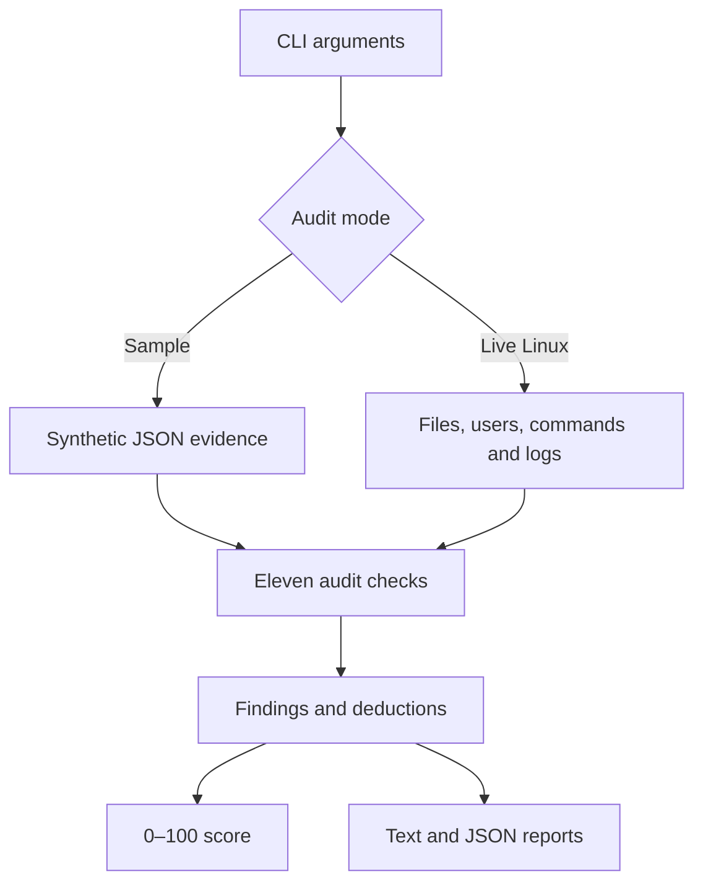

# Architecture

## Components

- **Command runner:** executes an allowlisted set of read-only Linux commands with a timeout.
- **Parsers:** convert `ss`, authentication-log, and SSH configuration text into structured evidence.
- **Audit checks:** return a consistent finding containing status, evidence, advice, and deduction.
- **Scoring:** begins at 100 and subtracts visible deductions, never going below zero.
- **Report writer:** creates human-readable and machine-readable output.

## Trust boundaries

System files and command output are treated as untrusted input. Reports should be stored somewhere writable only by the auditor. The tool does not use `sudo`, make changes, or send data over a network.
